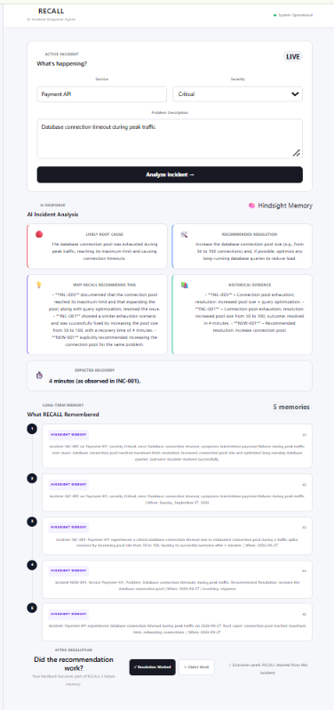
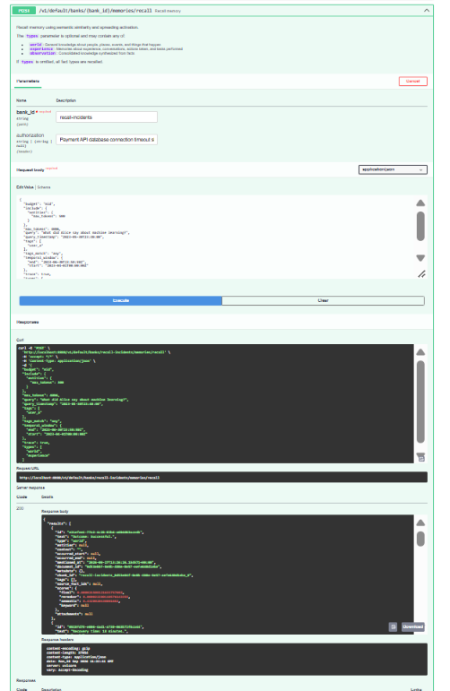
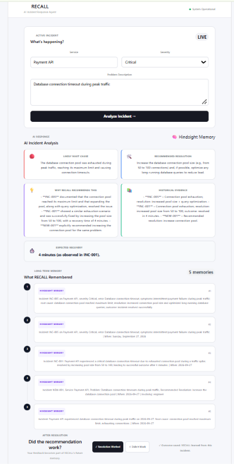

# Building RECALL: An Incident Response Agent That Learns From Past Failures

Production incidents rarely happen in isolation.

A database timeout today may look like a completely new problem, but somewhere in the history of a system, an engineer may already have diagnosed the same failure, applied a fix, and documented what happened.

The problem is that most incident response systems do not make that history part of the reasoning process.

I built RECALL around a simple idea: an incident response agent should not only reason about the current incident. It should be able to remember previous incidents, retrieve relevant experiences, use them as evidence, and learn from the outcome of the current resolution.

The core loop is:

**RETAIN → RECALL → REASON → RESOLVE → LEARN**

## What RECALL Does

RECALL is an AI incident response agent designed to assist engineers during production incidents.

An engineer provides information about an incident:

- Service
- Severity
- Problem description

RECALL then retrieves relevant historical incidents from Hindsight and gives those memories to the AI reasoning layer.

The agent uses the retrieved history to produce:

1. A likely root cause
2. A recommended resolution
3. An explanation of why the recommendation is supported
4. Historical evidence
5. An expected recovery time when historical evidence supports it

After the engineer applies the recommendation, they can record whether the resolution worked and how long recovery took.

That outcome is then retained as new memory.

This means the system has a feedback loop rather than a one-time answer.

## The Architecture

The application has three main layers.

```text
React Frontend
      |
      v
FastAPI Backend
      |
      +------------------+
      |                  |
      v                  v
   Hindsight            Groq
   Memory              LLM
      |                  |
      +--------+---------+
               |
               v
        Incident Analysis
The React frontend provides the incident interface.

The FastAPI backend coordinates the workflow.

Hindsight provides persistent agent memory, while the LLM is responsible for reasoning over the current incident and retrieved historical evidence.

The important architectural decision is that the LLM does not receive an empty context and simply generate a generic troubleshooting response.

Instead, RECALL first asks its memory layer for relevant experience.
### RECALL Incident Dashboard


Why Memory Changes the Agent

Consider a Payment API experiencing database connection timeouts during peak traffic.

Without historical memory, an AI assistant might suggest several generic possibilities:

Database overload
Network problems
Connection pool exhaustion
Slow queries
Database availability issues

That is useful, but it leaves the engineer with a list of possibilities.

RECALL takes a different approach.

It searches historical incidents for similar situations.

For example, the stored incidents include previous Payment API failures where database connection pools became exhausted during traffic spikes.

One historical incident documented a resolution that increased the connection pool from 50 to 100 connections.

Another Payment API incident had a similar database timeout pattern.

Instead of treating these as unrelated facts, RECALL retrieves them as evidence for the current incident.

The difference is not simply that the model has more text.

The difference is that the model has access to experience from previous incidents.

How Recall Works

The backend first builds a search query from the current incident.

query = (
    f"Service: {incident.service}. "
    f"Severity: {incident.severity}. "
    f"Problem: {incident.problem}"
)

That query is sent to Hindsight.

response = await hindsight.arecall(
    bank_id=BANK_ID,
    query=query,
    max_tokens=2000,
    budget="mid"
)

The returned memories are then collected and passed into the reasoning prompt.

memories = []

for result in response.results[:5]:
    memories.append(result.text)

historical_context = "\n\n".join(
    f"MEMORY {i + 1}:\n{memory}"
    for i, memory in enumerate(memories)
)
### Hindsight Recall in Action


This creates a boundary between retrieval and reasoning.

Hindsight is responsible for finding relevant historical experience.

The LLM is responsible for interpreting that evidence.

Making the Model Respect Historical Evidence

One of the important design decisions was preventing the model from treating historical context as something it could freely invent from.

The reasoning prompt explicitly tells the model:

- Identify the most likely root cause.
- Recommend a practical resolution.
- Explain why the recommendation is supported by historical incidents.
- Mention the incident IDs that support the recommendation.
- Give an estimated recovery time ONLY if historical evidence supports it.
- NEVER invent historical actions or outcomes.
- If the evidence is insufficient, clearly say so.

This matters because an incident response assistant should distinguish between:

What the historical record says

and

What the model thinks might be true.

For example, if a previous incident explicitly records that increasing the database connection pool resolved the problem in five minutes, the agent can use that information.

If the memory does not contain a recovery time, the agent should not manufacture one.

That makes the retrieved memory evidence rather than decoration.

A Concrete Incident

For the demonstration, I used a Payment API incident:

Service: Payment API
Severity: Critical
Problem: Database connection timeout during peak traffic

RECALL retrieves historical incidents related to Payment API database timeouts and peak traffic.

The retrieved history included incidents such as:

INC-001
Payment API database connection timeout
Root cause: exhausted connection pool
Resolution: increase pool size from 50 to 100
Outcome: successful
Recovery: 4 minutes

Another related incident documented a similar timeout during peak traffic and supported increasing the connection pool and optimizing long-running queries.

The agent can therefore connect the current symptoms with previous evidence.

The result is a recommendation grounded in the system's own incident history rather than a generic troubleshooting checklist.

Learning From the Resolution

The most important part of RECALL happens after the recommendation.

An incident response system should not stop when it produces an answer.

The engineer can provide feedback about what actually happened.

For example:

Engineer Action:
Increased the database connection pool from 50 to 100

Outcome:
SUCCESSFUL

Recovery Time:
5 minutes

RECALL stores this outcome back into Hindsight.

learning = f"""
Incident outcome learning:

Service: {feedback.service}
Problem: {feedback.problem}

Recommended Resolution:
{feedback.recommended_resolution[:500]}

Engineer Action:
{feedback.engineer_action}

Outcome:
{feedback.outcome}

Recovery Time:
{feedback.recovery_time_minutes} minutes
"""

The important part is that the feedback contains the actual result of the incident.

The system now has a new piece of operational experience.
### RECALL Learning From Engineer Feedback


The Before and After

The behavior I wanted to achieve can be summarized simply.

Before memory
Incident
   ↓
LLM
   ↓
Generic troubleshooting suggestions
With RECALL
Incident
   ↓
Hindsight Recall
   ↓
Historical incidents
   ↓
LLM reasoning
   ↓
Evidence-based recommendation
   ↓
Engineer resolution
   ↓
Outcome
   ↓
Hindsight Retain
   ↓
Future incidents benefit from the experience

This is the part of the system that makes persistent agent memory useful.

The value of memory is not simply remembering text.

It is allowing previous outcomes to influence future decisions.

What I Learned
1. Retrieval should happen before reasoning

An LLM can reason about an incident without historical context, but the reasoning becomes much more useful when the system first retrieves relevant experience.

The separation also makes the architecture easier to understand:

Hindsight retrieves. The LLM reasons.

2. Historical evidence needs boundaries

Memory should not become an invitation for the model to invent details.

Explicit instructions such as "never invent historical actions or outcomes" help maintain a clear distinction between stored evidence and generated reasoning.

3. Feedback completes the memory loop

The most interesting part of the system is not the initial recall.

It is what happens after the engineer resolves the incident.

A successful resolution becomes another piece of operational knowledge that can be retrieved later.

4. Persistent memory changes the role of the agent

Without memory, an incident agent behaves like a troubleshooting assistant.

With persistent memory, it can begin behaving more like an engineer that has access to the history of previous incidents.

The distinction is important because production systems accumulate knowledge over time.

That knowledge should not disappear between conversations.

5. A small incident dataset is enough to demonstrate the concept

I used synthetic incident data covering services such as Payment API, Order Service, Authentication, Notification, Search, User Profile, and Inventory.

The goal was not to create a huge incident database.

The goal was to demonstrate the complete memory lifecycle:

retain → recall → reason → resolve → learn.

Hindsight as the Memory Layer

I used Hindsight as the persistent memory layer for RECALL.

The integration provides two important capabilities for the application:

Retaining new incident knowledge
Recalling relevant historical knowledge

This allowed me to keep the incident-response logic separate from the memory system.

Instead of building a custom collection of retrieval logic and manually managing historical context, RECALL can treat Hindsight as its long-term memory layer.

For more information, see the
Hindsight GitHub repository,
the Hindsight documentation,
and Vectorize's guide to agent memory.

What the Finished Flow Looks Like

The complete interaction is:

1. Engineer reports an incident
             ↓
2. RECALL searches Hindsight
             ↓
3. Similar incidents are retrieved
             ↓
4. LLM analyzes the current incident
             ↓
5. Agent recommends a resolution
             ↓
6. Engineer applies the resolution
             ↓
7. Engineer records the outcome
             ↓
8. Outcome is retained in Hindsight
             ↓
9. Future incidents can recall that experience

The key idea is simple:

Every incident teaches the next one.

That is the behavior I wanted RECALL to capture.        